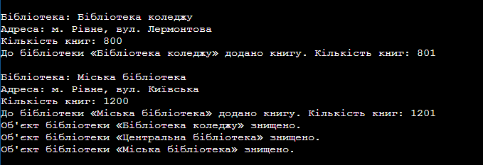

# Лабораторна робота №1: Створення першого проєкту. Класи, об’єкти, конструктори та деструктори
**Варіант 13: Клас Library**

## Короткий опис
У даній лабораторній роботі створено базову структуру консольного проєкту C# та реалізовано клас `Library`.

### Основні елементи класу:
* **Приватні поля:** `_name` (назва бібліотеки), `_address` (адреса).
* **Властивість:** `BooksCount` (кількість книг) із доступом для читання та зміни.
* **Конструктор:** Ініціалізує назву, адресу та початкову кількість книг.
* **Метод:** `AddBook()` — додає вказану кількість книг до бібліотеки та виводить оновлений статус у консоль.

## Результат виконання програми

## Висновок
Під час виконання роботи опановано базові принципи ООП (інкапсуляція, класи, об'єкти), налаштовано середовище розробки VS Code та підключено систему контролю версій Git.