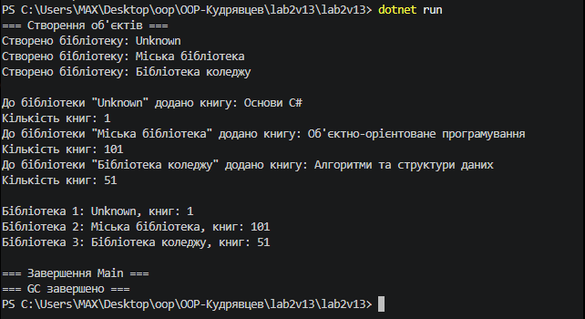

# Лабораторна робота №2: Клас із кількома конструкторами. Життєвий цикл об’єкта
**Варіант 13: Клас Library**

## Короткий опис
У даній лабораторній роботі реалізовано клас `Library` з приватними полями (`_name`, `_address`, `_booksCount`), перевантаженими конструкторами із ланцюговим викликом (`: this()`), властивостями для читання та методом `AddBook()`. Також додано деструктор для демонстрації роботи збирача сміття (Garbage Collector).

## Результат виконання програми

## Висновок
Під час виконання роботи досліджено порядок викликів перевантажених конструкторів та життєвий цикл об'єктів у C#. Продемонстровано примусовий виклик GC для виконання фіналізаторів/деструкторів.
