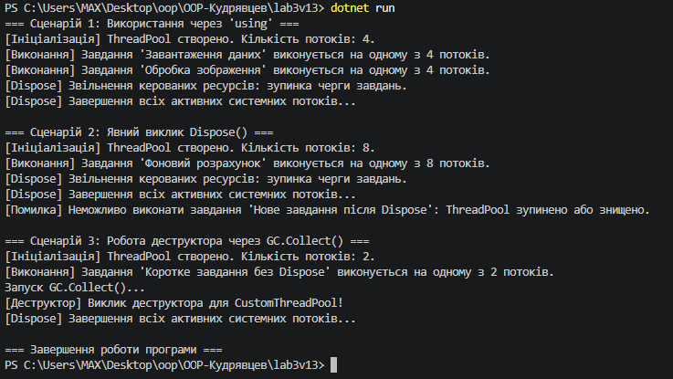

# Лабораторна робота №3: Життєвий цикл об’єкта та керування ресурсами
**Варіант 13: Клас ThreadPool**

## Короткий опис
У даній лабораторній роботі реалізовано клас `CustomThreadPool`, який імітує пул потоків та повністю реалізує патерн `Dispose` (інтерфейс `IDisposable`).

### Основні елементи класу:
* **Приватні поля:** `_poolSize` (int), `_isActive` (bool), `_disposed` (bool).
* **Метод:** `ExecuteTask(string taskName)` — виконує завдання, якщо ресурс активний.
* **Патерн Dispose:**
  - `Dispose()` — виклики для явного та автоматичного звільнення ресурсів.
  - `Dispose(bool disposing)` — розрізняє звільнення керованих та некерованих ресурсів.
  - **Деструктор (`~CustomThreadPool`)** — гарантує звільнення ресурсів при роботі збирача сміття (GC).

## Результат виконання програми

## Висновок
Під час виконання роботи опановано життєвий цикл об'єктів у C#, принципи роботи з некерованими ресурсами, оператор `using`, а також практичне застосування патерну `Dispose` та роботи збирача сміття `GC.Collect()`.