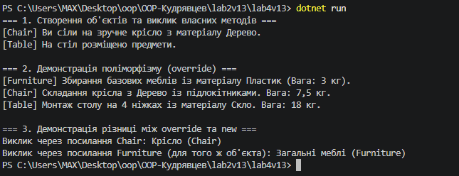

# Лабораторна робота №4: Наслідування. Ключові слова base, override, virtual. Приховування членів (new)
**Варіант 13: Ієрархія Furniture → Chair → Table**

## Короткий опис
У даній лабораторній роботі реалізовано ієрархію класів:
* **Furniture (базовий клас):** містить властивості `Material`, `Weight`, віртуальний метод `Assemble()` та метод `GetFurnitureType()`.
* **Chair (похідний клас):** наслідує `Furniture`, викликає конструктор базового класу через `base(...)`, перевизначає `Assemble()` через `override`, містить власний метод `SitOn()` та приховує метод `GetFurnitureType()` за допомогою модифікатора `new`.
* **Table (похідний клас):** наслідує `Furniture`, викликає `base(...)`, перевизначає `Assemble()` та має власний метод `PlaceItems()`.

## Результат виконання програми

## Відповіді на контрольні запитання
1. **Принцип наслідування в ООП:** Дозволяє похідному класу успадковувати поля, властивості та методи базового класу. Наприклад: Легковий автомобіль є різновидом Транспортного засобу.
2. **Призначення ключового слова `base`:** Використовується для звернення до елементів базового класу з похідного (наприклад, для виклику конструктора базового класу `base(...)` або його методів `base.Assemble()`).
3. **Різниця між `virtual` та `override`:** `virtual` у базовому класі дозволяє перевизначити метод у похідних, а `override` надає нову реалізацію. Взаємодія цих модифікаторів забезпечує динамічний поліморфізм.
4. **Модифікатор `new`:** Приховує член базового класу замість його перевизначення. При виклику через посилання типу базового класу виконується метод базового класу, а при виклику через посилання похідного типу — новий метод.

## Висновок
Під час виконання роботи опановано створення ієрархій класів у C#, принципи використання `base`, `virtual`, `override` та практичну різницю між перевизначенням членів і їх приховуванням через `new`.