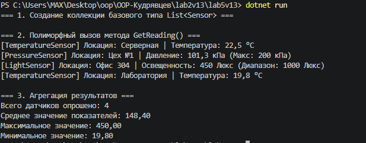

# Лабораторна робота №5: Поліморфізм: динамічне зв’язування та перевизначення методів
**Варіант 13: Поліморфні сенсори (Sensor → TemperatureSensor, PressureSensor, LightSensor)**

## Короткий опис
У даній лабораторній роботі реалізовано ієрархію сенсорів з поліморфною поведінкою:
* **Sensor (базовий клас):** містить властивість `Location` та віртуальний метод `GetReading()`.
* **TemperatureSensor (похідний клас):** реалізує `GetReading()` для отримання температури.
* **PressureSensor (похідний клас):** реалізує `GetReading()` для отримання показників тиску.
* **LightSensor (похідний клас):** реалізує `GetReading()` для отримання рівня освітленості.

У методі `Main` використано колекцію `List<Sensor>` для збереження різних типів сенсорів, виклику методів через динамічне зв'язування та обчислення агрегованих значень (середнє, максимальне, мінімальне).

## Результат виконання програми

## Відповіді на контрольні запитання
1. **Що таке поліморфізм і як він реалізується в C#:** Поліморфізм — це здатність об'єктів різних типів реагувати на один і той самий виклик методу по-різному. У C# він досягається за допомогою оголошення віртуального методу `virtual` у базовому класі та його перевизначення `override` у похідних класах.
2. **Поняття динамічного зв’язування:** Це процес, за якого визначення того, яка саме реалізація методу буде викликана, відбувається під час виконання програми (Runtime), а не під час компіляції (Compile-time).
3. **Гнучкість та розширюваність поліморфізму:** Дозволяє додавати нові типи сенсорів (наприклад, `HumiditySensor`), не змінюючи основний код обробки та обчислення середніх значень у циклі.
4. **Переваги колекцій базових типів:** Колекція `List<BaseClass>` дозволяє зберігати різнорідні об'єкти (різні похідні класи) в одному списку та обробляти їх єдиним уніфікованим способом.

## Висновок
Під час виконання роботи опановано реалізацію поліморфізму в C#, динамічне зв'язування методів та агрегацію результатів викликів через колекцію базового типу.